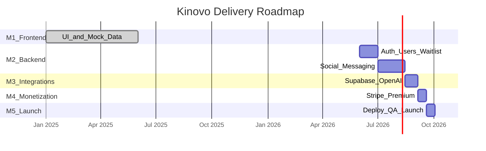

# Kinovo — Project Milestones & Delivery Plan

**Document version:** 1.0  
**Date:** June 2026  
**Project:** Kinovo — Travel. Connect. Belong.  
**Platform:** Next.js 14 web app (PWA-ready)  
**Target domain:** kinovo.life  

---

## Executive Summary

Kinovo is an invite-only, AI-powered travel and social discovery platform. Development is organized into **5 milestones**. **Milestone 1 is complete** — a fully functional frontend MVP with mock data and partial API stubs. **Milestones 2–5** cover backend, integrations, monetization, and production launch.

| Milestone | Name | Status | Progress |
|-----------|------|--------|----------|
| M1 | Frontend MVP & Design System | **Complete** | 100% |
| M2 | Backend API & Database | **Not started** | 0% |
| M3 | Third-Party Integrations | **Not started** | 0% |
| M4 | Monetization & Premium Features | **Not started** | 0% |
| M5 | Production Launch & Polish | **In progress** | ~20% |

---

## Milestone Overview



---

## Milestone 1 — Frontend MVP & Design System

**Status:** Complete  
**Goal:** Deliver a demo-ready product with all core screens, navigation, and premium UI.

### Deliverables (Delivered)

| # | Deliverable | Location | Notes |
|---|-------------|----------|-------|
| 1.1 | Landing page (hero, waitlist, destinations, pricing) | `/`, `/landing` | Waitlist API wired on `/landing` |
| 1.2 | Authentication UI (login, signup, invite code) | `/auth` | Client-side mock auth today |
| 1.3 | Discover (destinations, travelers, groups) | `/discover` | Mock data from `lib/mockData.js` |
| 1.4 | Messaging UI with translation toggle | `/messages` | Mock conversations |
| 1.5 | AI Concierge chat interface | `/concierge` | Local mock responses |
| 1.6 | User profile & edit (with AI enhance/import) | `/profile`, `/profile/edit` | AI enhance API wired |
| 1.7 | Community (discussions + city groups) | `/community` | AI prompts API wired |
| 1.8 | Safety Center | `/safety` | Static guidelines |
| 1.9 | Mobile bottom navigation + PWA manifest | `components/BottomNav.js` | Installable web app |
| 1.10 | Dark glassmorphism design system | Tailwind + shadcn/ui | Consistent across all pages |
| 1.11 | Partial API layer (11 endpoints) | `app/api/[[...path]]/route.js` | Stubs + AI routes |

### Acceptance Criteria (Met)

- All primary user flows are navigable without errors
- Responsive on mobile, tablet, and desktop
- Premium visual quality aligned with Airbnb / Raya / Soho House aesthetic
- Demo-ready with realistic mock data

### Supporting Documents

- [README.md](./README.md) — Project overview
- [LANDING_PAGE_README.md](./LANDING_PAGE_README.md) — Landing page specification
- [AI_FEATURES_GUIDE.md](./AI_FEATURES_GUIDE.md) — AI feature breakdown

---

## Milestone 2 — Backend API & Database

**Status:** Not started  
**Goal:** Replace mock data with a real backend — authentication, profiles, social features, and messaging.  
**Estimated duration:** 6–8 weeks  
**Dependency:** Client provides Supabase project credentials (or approves alternative backend)

### Scope

| Phase | Domain | Endpoints | Priority |
|-------|--------|-----------|----------|
| 2A | Auth & session | 7 | Critical |
| 2A | Waitlist & invites | 4 | Critical |
| 2A | Users & profiles | 10 | Critical |
| 2B | Destinations | 3 | High |
| 2B | Travel groups | 5 | High |
| 2B | Connections | 3 | High |
| 2B | Messaging | 6 | High |
| 2C | Community | 7 | Medium |
| 2C | Safety & moderation | 6 | Medium |
| 2C | Search & platform stats | 2 | Medium |

**Total REST endpoints:** 67 (11 exist as stubs; 56 to build)  
**Realtime channels:** 3 (Supabase — messages, presence, notifications)

### Deliverables

| # | Deliverable | Description |
|---|-------------|-------------|
| 2.1 | Database schema deployed | Users, destinations, groups, messages, invites, community, safety tables |
| 2.2 | Authentication system | Login, signup (invite-only), logout, session, OAuth placeholders |
| 2.3 | User profile CRUD | Read/update profile, avatar, stats, verification request |
| 2.4 | Discover backend | Destinations, traveler discovery, match scoring |
| 2.5 | Social graph | Connections, travel groups (join/leave) |
| 2.6 | Messaging system | Conversations, send/receive, read receipts, content moderation |
| 2.7 | Community backend | Discussions, replies, city groups |
| 2.8 | Safety tools | Reports, blocks, support tickets |
| 2.9 | API documentation | Full endpoint catalog with request/response schemas |
| 2.10 | Frontend wired to APIs | All mock data replaced with live API calls |

### Acceptance Criteria

- User can sign up with valid invite code and log in securely
- Profile changes persist across sessions
- Users can discover destinations, connect with travelers, and send messages
- Messages are moderated before delivery
- All API endpoints documented and testable
- Row-level security enabled on Supabase

### Client Actions Required

- [ ] Create Supabase project and share credentials
- [ ] Approve database schema (provided in [SETUP_GUIDE.md](./SETUP_GUIDE.md))
- [ ] Provide invite code strategy (single master code vs per-user codes)
- [ ] Review and sign off API specification ([API_DOCUMENTATION.md](./API_DOCUMENTATION.md))

---

## Milestone 3 — Third-Party Integrations

**Status:** Not started  
**Goal:** Connect live AI, translation, and real-time features.  
**Estimated duration:** 2–3 weeks  
**Dependencies:** Milestone 2 complete; client provides API keys

### Integrations

| # | Service | Purpose | Client provides |
|---|---------|---------|-----------------|
| 3.1 | **OpenAI** | AI concierge, profile enhance, icebreakers, translation, moderation | `OPENAI_API_KEY` |
| 3.2 | **Supabase Realtime** | Live messaging, online presence | Included with Supabase |
| 3.3 | **Mapbox** (optional) | Interactive maps, location features | `MAPBOX_ACCESS_TOKEN` |

### Deliverables

| # | Deliverable | Description |
|---|-------------|-------------|
| 3.1 | Live AI Concierge | `/concierge` calls `POST /api/concierge` with GPT-4o-mini |
| 3.2 | Real-time translation | Messages auto-translate when toggle enabled |
| 3.3 | Content moderation | All outbound messages checked via OpenAI Moderation API |
| 3.4 | Real-time messaging | Supabase Realtime channels for instant delivery |
| 3.5 | Online presence | Green dot / "Active now" indicator on messages |
| 3.6 | Concierge usage limits | Lite: 10 requests/day; Premium: unlimited |

### Acceptance Criteria

- AI concierge returns contextual travel recommendations (not mock text)
- Translation works across 7 supported languages
- Messages appear in real time without page refresh
- Flagged content is blocked before sending
- Usage limits enforced per subscription tier

### Client Actions Required

- [ ] Create OpenAI account and add billing ($10–20 starter credit)
- [ ] Share `OPENAI_API_KEY` securely
- [ ] Decide if Mapbox is needed for v1 launch

---

## Milestone 4 — Monetization & Premium Features

**Status:** Not started  
**Goal:** Enable paid subscriptions and premium feature gating.  
**Estimated duration:** 2 weeks  
**Dependencies:** Milestone 2 complete; client provides Stripe account

### Subscription Tiers

| Tier | Price | Key features |
|------|-------|--------------|
| **Free** | £0 | Browse destinations, basic messaging, join groups |
| **Lite** | £2.99/mo | AI concierge (10/day), translation, advanced filters |
| **Premium** | £4.99/mo | Unlimited AI, anonymous browsing, profile boosts, private galleries |

Full pricing rationale: [PRICING_STRATEGY.md](./PRICING_STRATEGY.md)

### Deliverables

| # | Deliverable | Description |
|---|-------------|-------------|
| 4.1 | Stripe checkout integration | `POST /api/billing/checkout` |
| 4.2 | Subscription management | `GET /api/billing/subscription` |
| 4.3 | Stripe webhooks | Auto-update `isPremium` on payment events |
| 4.4 | Feature gating | Premium-only features locked for free users |
| 4.5 | Upgrade UI wired | Profile "Upgrade to Premium" button functional |
| 4.6 | Invite & ambassador rewards | QR invite codes with premium perks |

### Acceptance Criteria

- User can subscribe to Lite or Premium via Stripe Checkout
- Subscription status syncs to user profile within 30 seconds
- Premium features unlock immediately after payment
- Failed payments handled gracefully with retry prompts
- Stripe dashboard shows active subscriptions

### Client Actions Required

- [ ] Create Stripe account and complete business verification
- [ ] Share `STRIPE_SECRET_KEY`, `STRIPE_WEBHOOK_SECRET`, publishable key
- [ ] Confirm final pricing tiers and currency
- [ ] Set up Stripe products for Lite (£2.99) and Premium (£4.99)

---

## Milestone 5 — Production Launch & Polish

**Status:** In progress (~20%)  
**Goal:** Deploy to production, fix deployment issues, QA, and go live on kinovo.life.  
**Estimated duration:** 2 weeks after M2–M4  
**Dependencies:** Milestones 2–4 complete

### Deliverables

| # | Deliverable | Status | Description |
|---|-------------|--------|-------------|
| 5.1 | Vercel production deployment | In progress | Build fixes applied; redeploy needed |
| 5.2 | Custom domain (kinovo.life) | Pending | DNS + SSL configuration |
| 5.3 | Environment variables configured | Pending | All keys set in Vercel dashboard |
| 5.4 | SEO & Open Graph metadata | Done | Configured in `app/layout.tsx` |
| 5.5 | PWA installable | Done | `manifest.json` + icons |
| 5.6 | Performance optimization | Pending | Lighthouse audit > 90 |
| 5.7 | Security headers | Done | Configured in `vercel.json` |
| 5.8 | End-to-end QA | Pending | Full user journey testing |
| 5.9 | Beta invite rollout | Pending | First 100–500 users |
| 5.10 | Monitoring & error tracking | Pending | Sentry or Vercel Analytics |

### Acceptance Criteria

- App loads at kinovo.life with no 404 errors
- All user flows work end-to-end in production
- Lighthouse performance score > 90 on mobile
- SSL certificate active
- Error monitoring captures and alerts on failures
- Beta users can sign up, connect, and message successfully

### Deployment Guide

Full instructions: [VERCEL_DEPLOYMENT_GUIDE.md](./VERCEL_DEPLOYMENT_GUIDE.md)

### Client Actions Required

- [ ] Point kinovo.life DNS to Vercel
- [ ] Approve beta launch date
- [ ] Prepare initial invite codes for beta users
- [ ] Set up support email / contact channel

---

## API Roadmap Summary

### Currently Built (11 endpoints — stubs/mocks)

| Method | Endpoint | Wired to UI |
|--------|----------|-------------|
| GET | `/api/` | No |
| GET/POST | `/api/waitlist` | Yes (`/landing`) |
| POST | `/api/auth/login` | No |
| POST | `/api/auth/signup` | No |
| POST | `/api/ai/profile-enhance` | Yes |
| POST | `/api/ai/icebreaker` | Component only |
| POST | `/api/ai/moderate` | No |
| GET | `/api/ai/discussion-prompts` | Yes |
| POST | `/api/concierge` | No |
| POST | `/api/translate` | No |

### To Be Built (56 endpoints across 12 domains)

| Domain | Count | Milestone |
|--------|-------|-----------|
| Authentication & session | 5 | M2 |
| Invites & waitlist admin | 4 | M2 |
| Users & profiles | 10 | M2 |
| Destinations | 3 | M2 |
| Travel groups | 5 | M2 |
| Connections | 3 | M2 |
| Messaging | 6 | M2 |
| Community | 7 | M2 |
| AI & concierge extensions | 2 | M3 |
| Safety & moderation | 6 | M2 |
| Billing & Stripe | 3 | M4 |
| Search & platform stats | 2 | M2 |

Full specification: [API_DOCUMENTATION.md](./API_DOCUMENTATION.md)

---

## Frontend → Backend Wiring Checklist

Tracks which UI actions still use mock data and need API connection in Milestone 2.

| Page | Action | Target API | Milestone |
|------|--------|------------|-----------|
| `/auth` | Login / Signup | `POST /api/auth/login`, `/signup` | M2 |
| `/` | Waitlist form | `POST /api/waitlist` | M2 (partially done on `/landing`) |
| `/discover` | Load destinations | `GET /api/destinations` | M2 |
| `/discover` | Connect with traveler | `POST /api/connections` | M2 |
| `/discover` | Join travel group | `POST /api/groups/:id/join` | M2 |
| `/discover` | Destination detail page | `GET /api/destinations/:id` + new page | M2 |
| `/messages` | Send message | `POST /api/conversations/:id/messages` | M2 |
| `/messages` | Auto-translate | `POST /api/translate` | M3 |
| `/concierge` | Send chat | `POST /api/concierge` | M3 |
| `/profile/edit` | Save profile | `PATCH /api/users/me` | M2 |
| `/profile` | Upgrade to Premium | `POST /api/billing/checkout` | M4 |
| `/community` | New post | `POST /api/community/discussions` | M2 |
| `/community` | Join city group | `POST /api/community/city-groups/:id/join` | M2 |
| `/safety` | Report / block | `POST /api/reports`, `/users/:id/block` | M2 |

---

## Environment Variables Checklist

All variables required before production launch:

```bash
# Supabase (M2)
NEXT_PUBLIC_SUPABASE_URL=
NEXT_PUBLIC_SUPABASE_ANON_KEY=
SUPABASE_SERVICE_ROLE_KEY=

# OpenAI (M3)
OPENAI_API_KEY=

# Stripe (M4)
STRIPE_SECRET_KEY=
STRIPE_WEBHOOK_SECRET=
NEXT_PUBLIC_STRIPE_PUBLISHABLE_KEY=

# App (M5)
NEXT_PUBLIC_BASE_URL=https://kinovo.life
JWT_SECRET=

# Optional (M3)
MAPBOX_ACCESS_TOKEN=
```

---

## Document Index

Send this package to the client alongside this milestone document:

| Document | Purpose |
|----------|---------|
| **CLIENT_MILESTONES.md** (this file) | Milestone plan, status, and delivery roadmap |
| [README.md](./README.md) | Product overview and quick start |
| [API_DOCUMENTATION.md](./API_DOCUMENTATION.md) | Complete backend API specification |
| [SETUP_GUIDE.md](./SETUP_GUIDE.md) | Integration setup (Supabase, OpenAI, Stripe) |
| [AI_FEATURES_GUIDE.md](./AI_FEATURES_GUIDE.md) | AI features detail |
| [PRICING_STRATEGY.md](./PRICING_STRATEGY.md) | Subscription tiers and business model |
| [VERCEL_DEPLOYMENT_GUIDE.md](./VERCEL_DEPLOYMENT_GUIDE.md) | Deployment instructions |
| [LANDING_PAGE_README.md](./LANDING_PAGE_README.md) | Landing page design spec |

---

## Recommended Next Steps

1. **Client review** — Review and approve this milestone plan
2. **Supabase setup** — Client creates project; dev team deploys schema (unblocks M2)
3. **API build** — Implement Milestone 2 backend (6–8 weeks)
4. **Integration keys** — Client provides OpenAI + Stripe keys when M2 nears completion
5. **Beta launch** — Milestone 5 go-live on kinovo.life with invite-only access

---

## Sign-Off

| Role | Name | Signature | Date |
|------|------|-----------|------|
| Client | | | |
| Project Lead | | | |
| Developer | | | |

---

*Kinovo — Travel responsibly, connect safely.*
