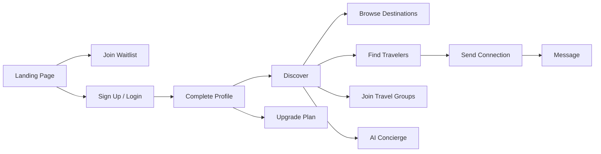

# Kinovo — Milestone 1: Backend Foundation & Authentication

**Status:** Complete  
**Stack:** Node.js, Express, MongoDB (Atlas), JWT  
**Base URL:** `http://localhost:4000/api`

---

## Project Overview

### What is Kinovo?

Kinovo is an **invite-only travel and social discovery platform** for open-minded travelers. Users can discover destinations, connect with compatible travelers, join travel groups, message each other, and use AI-powered features (concierge, translation, profile enhancement).

### Main Goals

| Goal | Description |
|------|-------------|
| **Safe community** | Invite-only beta, verification, trust scores, moderation |
| **Travel discovery** | Browse destinations, find travelers, join groups |
| **Real connections** | Connect, message, and meet people worldwide |
| **AI-powered experience** | Concierge, translation, match scoring, profile tools |
| **Monetization** | Free, Lite (£2.99), Premium (£4.99) tiers |

### Overall User Flow



### Milestone Roadmap

| Milestone | Focus | Status |
|-----------|-------|--------|
| **M1** | Backend foundation & authentication | **Complete** |
| M2 | Profiles, discover, groups, messaging | Planned |
| M3 | OpenAI + real-time features | Planned |
| M4 | Stripe billing & premium | Planned |
| M5 | Production launch (kinovo.life) | Planned |

---

## Milestone 1 Deliverables

| # | Deliverable | Status |
|---|-------------|--------|
| 1 | Project setup (Express backend) | Done |
| 2 | MongoDB database setup | Done |
| 3 | Environment configuration | Done |
| 4 | User registration | Done |
| 5 | User login | Done |
| 6 | JWT authentication | Done |
| 7 | Password reset | Done |
| 8 | Role-based authorization | Done |
| 9 | Security middleware | Done |
| 10 | Error handling | Done |

---

## API Endpoints

### Health

| Method | Endpoint | Auth | Description |
|--------|----------|------|-------------|
| GET | `/api/health` | No | Server health check |

### Authentication

| Method | Endpoint | Auth | Description |
|--------|----------|------|-------------|
| POST | `/api/auth/signup` | No | Register new user (invite code required) |
| POST | `/api/auth/login` | No | Sign in |
| POST | `/api/auth/logout` | Yes | Sign out |
| GET | `/api/auth/me` | Yes | Get current user |
| POST | `/api/auth/forgot-password` | No | Request password reset |
| POST | `/api/auth/reset-password` | No | Reset password with token |
| POST | `/api/auth/change-password` | Yes | Change password (logged in) |

### Admin (Role-based)

| Method | Endpoint | Auth | Role | Description |
|--------|----------|------|------|-------------|
| GET | `/api/admin/health` | Yes | admin | Verify admin access |

---

## Request & Response Examples

### Sign Up

```http
POST /api/auth/signup
Content-Type: application/json

{
  "email": "user@example.com",
  "password": "secret123",
  "name": "Alex Rivera",
  "inviteCode": "KINOVO2025"
}
```

**Response 201:**
```json
{
  "success": true,
  "user": {
    "id": "...",
    "email": "user@example.com",
    "name": "Alex Rivera",
    "role": "user",
    "verified": false,
    "isPremium": false
  },
  "token": "eyJhbG..."
}
```

### Login

```http
POST /api/auth/login

{ "email": "user@example.com", "password": "secret123" }
```

### Forgot Password

```http
POST /api/auth/forgot-password

{ "email": "user@example.com" }
```

**Response 200:**
```json
{
  "success": true,
  "message": "If that email exists, a reset link has been sent",
  "resetToken": "abc123..."
}
```

> `resetToken` is only returned in **development** mode. In production, send via email.

### Reset Password

```http
POST /api/auth/reset-password

{
  "token": "abc123...",
  "newPassword": "newsecret456"
}
```

### Change Password (authenticated)

```http
POST /api/auth/change-password
Authorization: Bearer <token>

{
  "currentPassword": "secret123",
  "newPassword": "newsecret456"
}
```

### Get Current User

```http
GET /api/auth/me
Authorization: Bearer <token>
```

---

## User Roles

| Role | Permissions |
|------|-------------|
| `user` | Default — access own profile, discover, message |
| `moderator` | Content moderation (future) |
| `admin` | Full platform access, admin endpoints |

Role is included in JWT and returned in user object.

---

## Security Features

| Feature | Implementation |
|---------|----------------|
| Password hashing | bcrypt (12 rounds) |
| JWT tokens | 7-day expiry, signed with `JWT_SECRET` |
| Rate limiting | 20 auth requests / 15 min per IP |
| HTTP headers | Helmet security headers |
| CORS | Restricted to frontend origin |
| Reset tokens | SHA-256 hashed, 1-hour expiry, single use |
| Invite-only signup | Valid invite code required |

---

## Error Responses

All errors follow this format:

```json
{
  "success": false,
  "error": "Error type",
  "message": "Human-readable description"
}
```

| Code | Meaning |
|------|---------|
| 400 | Validation error |
| 401 | Unauthorized |
| 403 | Forbidden (invalid invite / wrong role) |
| 404 | Not found |
| 409 | Conflict (email already exists) |
| 429 | Too many requests |
| 500 | Server error |

---

## Environment Variables

```bash
PORT=4000
MONGODB_URI=mongodb+srv://...@cluster.mongodb.net/kinovo
JWT_SECRET=your-long-random-secret
JWT_EXPIRES_IN=7d
CORS_ORIGIN=http://localhost:3000
DEFAULT_INVITE_CODE=KINOVO2025
NODE_ENV=development
```

---

## How to Run

```bash
# Backend
cd backend
npm install
npm run dev

# Frontend (separate terminal)
cd ..
npm run dev
```

Frontend `.env.local`:
```
NEXT_PUBLIC_API_URL=http://localhost:4000
```

---

## Database Collections (MongoDB)

| Collection | Purpose |
|------------|---------|
| `users` | User accounts and profiles |
| `invitecodes` | Beta invite codes |
| `passwordresettokens` | Password reset tokens (auto-expire) |

---

## Default Test Credentials

**Invite code:** `KINOVO2025` (seeded on first startup)

Create a test account via signup, then use login.

To make a user admin, update in MongoDB:
```js
db.users.updateOne({ email: "user@example.com" }, { $set: { role: "admin" } })
```

---

## Next Milestone (M2)

- User profile update API
- Destinations & travel groups CRUD
- Connections & messaging
- Discover travelers with match scoring

See [API_DOCUMENTATION.md](../API_DOCUMENTATION.md) for the full 67-endpoint roadmap.

---

*Kinovo — Travel responsibly, connect safely.*
